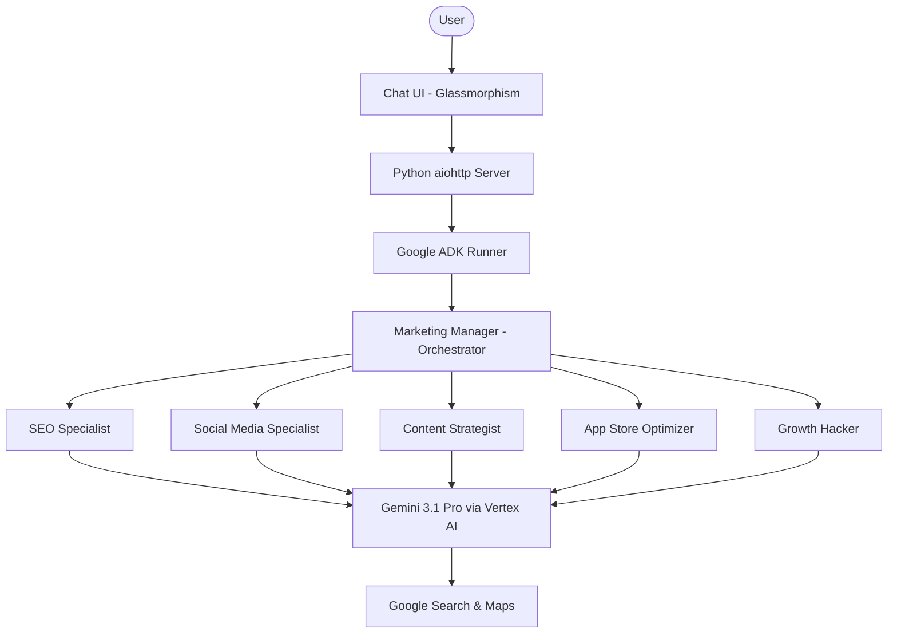

# 🚀 The Marketing Department | Agency

A high-performance, multi-agent marketing agency built with the **Google Agent Development Kit (ADK)** and powered by **Gemini 3.1 Pro**. This agency coordinates specialized AI experts to deliver grounded, real-time marketing strategies.

## ✨ Features

- **Brainy Orchestration**: A central `Marketing Manager` that analyzes complex missions and delegates tasks.
- **Specialized Expert Team**:
    - **SEO Specialist**: Search engine visibility and SERP analysis.
    - **App Store Optimizer (ASO)**: Mobile app growth and conversion.
    - **Growth Hacker**: Rapid acquisition and viral loops.
    - **Social Media Strategist**: Brand authority and community building.
    - **Content Creator**: Compelling storytelling and editorial planning.
- **Grounded reasoning**: Integrated with **Google Search** and **Google Maps** for real-time trend validation and local context.
- **Persistent Memory**: Uses session state to ensure agents remember sub-task outputs across multiple turns.
- **Premium UI**: A sleek, glassmorphism chat interface with light/dark theme support.

## 🏗️ Architecture

The system follows a hierarchical multi-agent pattern:



## 🛠️ Installation & Setup

### Prerequisites
- Python 3.10+
- Google Cloud Project with Vertex AI enabled.
- `gcloud` CLI installed and authenticated.

### 1. Clone the Repository
```bash
git clone https://github.com/emailandy/agencyADKagents.git
cd agencyADKagents
```

### 2. Set Up Environment
Create a virtual environment and install the required ADK dependencies.
```bash
python -m venv venv
source venv/bin/activate
pip install google-adk aiohttp
```

### 3. Configure Authentication
Ensure your Google Cloud credentials are set up:
```bash
gcloud auth application-default login
```

### 4. Run the Agency
```bash
python main.py
```
The agency will be live at `http://localhost:8080`.

## 📂 Project Structure
- `backend/agents/`: Agent definitions and personas.
- `frontend/ui/`: Static files and templates for the glassmorphism UI.
- `main.py`: The unified entry point serving the app and ADK logic.

---
Built with ❤️ using [Google ADK](https://github.com/google/adk-python).
